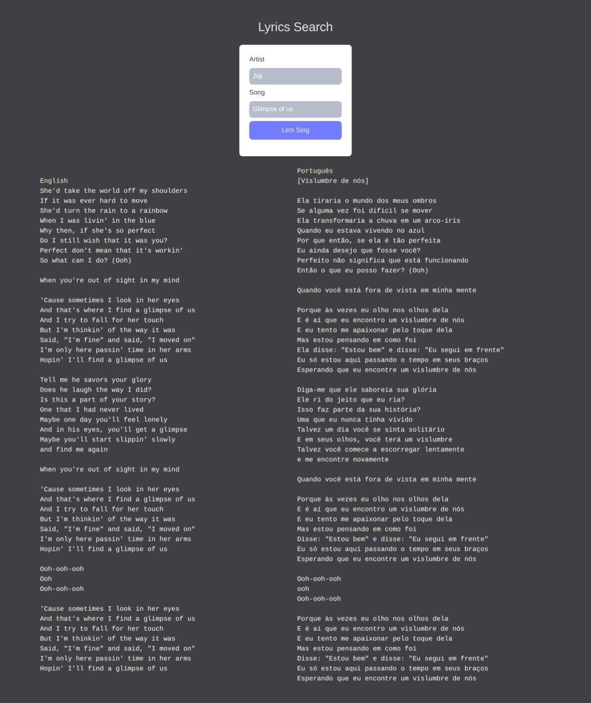

<h1>
<p align="center">
  
  <br>Lyrics Search
</h1>
  <p align="center">
    Search the lyrics of you favorite songs.
</p>
<p align="center">
  <a href="#about-the-project">About The Project</a> •
  <a href="#usage">How To Use</a> •
  <a href="#examples">Techs</a> •
</p>  

<p align="center">
  

</p>                                                                                                                             
                                                                                                                                            
## About The Project
Lyrics Search is a project created with javascript to study fetch api using vagalume api to imports the lyrics and learn how to use vite in projects.


## Usage
```bash
$ git clone https://github.com/guilhermehub12/lyrics-search.git

$ cd lyrics-search

$ npm install

$ npm run dev
```


## Techs
- HTML/CSS
- JavaScript
- Vite
- Tailwind
